РОССИЙСКИЙ УНИВЕРСИТЕТ ДРУЖБЫ НАРОДОВ\
**Факультет физико-математических и естественных наук**\
**Математический институт имени академика С.М. Никольского**
 
**ОТЧЕТ ПО ЛАБОРАТОРНОЙ РАБОТЕ № 2**\
дисциплина: Операционные системы
 
 
**Студент:** Домнина Алена\
**Группа:** НПМбв-02-21
 
**МОСКВА**\
2025 г.

# Цель работы

Изучить идеологию и применение средств контроля версий.
Освоить умения по работе с git.

# Последовательность выполнения работы

## Установка программного обеспечения

### Установка git

Установим git:

```bash
dnf install git
```

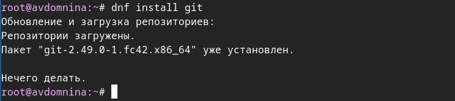

### Установка gh

Fedora:

```bash
dnf install gh
```

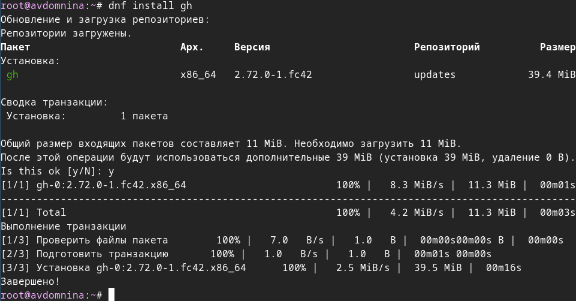

## Базовая настройка git

Зададим имя и email владельца репозитория:

```bash
git config --global user.name "Name Surname"
git config --global user.email "work@mail"
```


Настроим utf-8 в выводе сообщений git:

```bash
git config --global core.quotepath false
```


Зададим имя начальной ветки (будем называть её master):

```bash
git config --global init.defaultBranch master
```

параметр autocrlf:

```bash
git config --global core.autocrlf input
```

и параметр safecrlf:

```bash
git config --global core.safecrlf warn
```

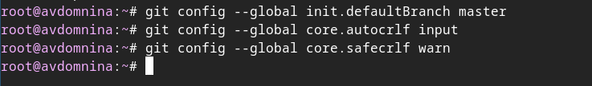

## Создание ключей ssh

по алгоритму rsa с ключом размером 4096 бит:

```bash
ssh-keygen -t rsa -b 4096
```

по алгоритму ed25519:

```bash
ssh-keygen -t ed25519
```

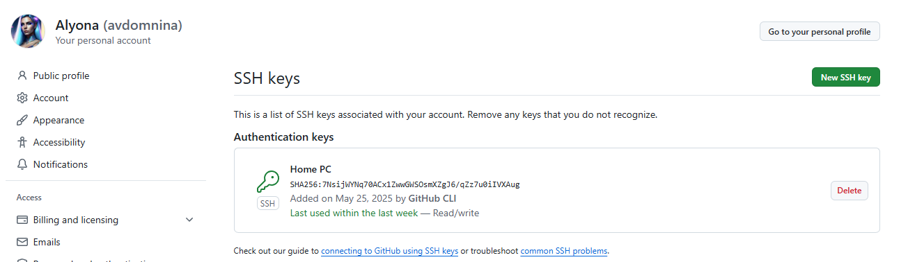

## Создание ключа pgp

Генерируем ключ

```bash
gpg --full-generate-key
```

Из предложенных опций выбираем:

- тип RSA and RSA;
- размер 4096;
- срок действия: значение по умолчанию — 0.

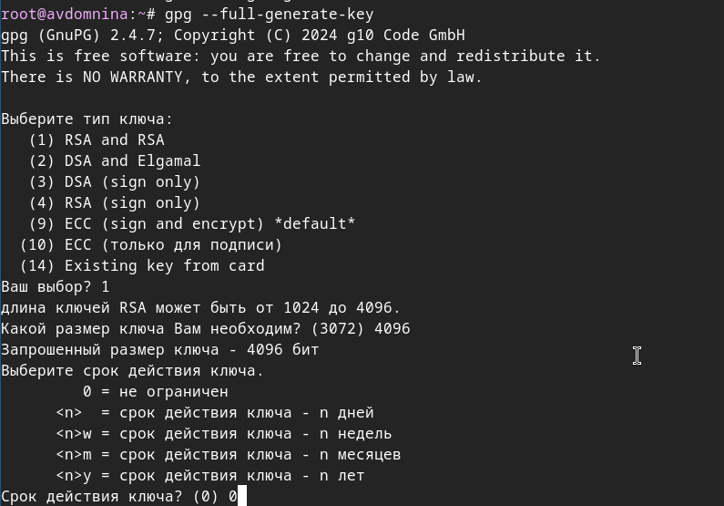

Задаем имя и адрес электронной почты, соответствующий адресу, Комментарий оставляю пустым.

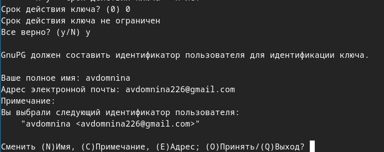

## Настройка github

Создаем учетную запись на https://github.com. В моем случае, она уже была создана. Заполним основные данные.


## Добавление GPG ключа в GitHub

Выводим список ключей и копируем отпечаток приватного ключа(ту часть, которая идет после `rsa4096/`):

```bash
gpg --list-secret-keys --keyid-format LONG
```

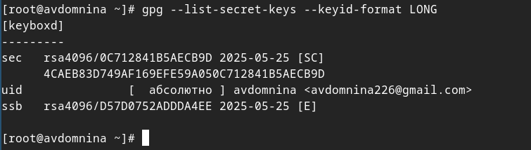

Экспортируем ключ в формате ASCII по его отпечатку:

```bash
gpg --armor --export <PGP Fingerprint>
```

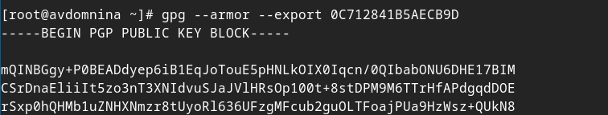

Копируем наш сгенерированный GPG ключ в буфер обмена:

```bash
gpg --armor --export <GPG Fingerprint> | xclip -sel clip
```

Перейдем в настройки GitHu, нажмем на кнопку New GPG key и вставляем полученный ключ в поле ввода.

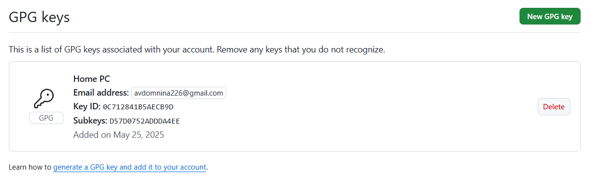

## Настройка автоматических подписей коммитов git

Используя введенный email, укажем Git применять его при подписи коммитов:

```bash
git config --global user.signingkey <PGP Fingerprint>
git config --global commit.gpgsign true
git config --global gpg.program $(which gpg2)
```

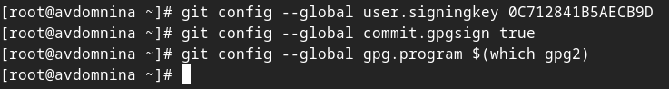

Установим чекбокс у `Flag unsigned commits as unverified` в разделе `Vigilant mode` для отметки неподписанных коммитов как непроверенных.

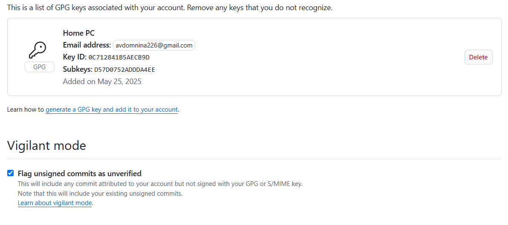

## Настройка gh

Для начала проходим авторизацию

```bash
gh auth login
```

После ответов на несколько наводящих вопросов, авторизуемся через браузер перейдя по предоставленной ссылке https://github.com/login/device и введя восьмизначный код.

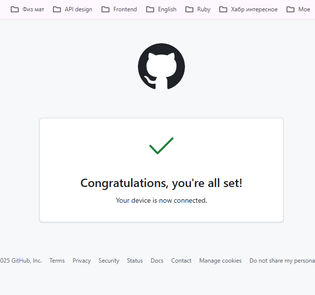

## Сознание репозитория курса на основе шаблона

Создаем шаблон рабочего пространства.
Например, для 2024–2025 учебного года и предмета «Операционные системы» (код предмета os-intro) создание репозитория примет следующий вид:

```bash
mkdir -p ~/work/study/2022-2023/"Операционные системы"
```

```bash
cd ~/work/study/2022-2023/"Операционные системы"
```

```bash
gh repo create study_2022-2023_os-intro --template=yamadharma/course-directory-student-template --public
```

```bash
git clone --recursive git@github.com:<owner>/study_2022-2023_os-intro.git os-intro
```

## Настройка каталога курса

Перейдем в каталог курса:

```bash
cd ~/work/study/2022-2023/"Операционные системы"/os-intro
```

Удалим лишние файлы:

```bash
rm package.json
```

Создаем необходимые каталоги:

```bash
echo os-intro > COURSE
make
```

Отправим файлы на сервер:

```bash
git add .
git commit -am 'feat(main): make course structure'
git push
```

# Вывод

Была изучена идеология систем контроля версий, а также освоены основные навыки работы с Git, что позволяет применять данный
инструмент для организации надежной и гибкой разработки программного обеспечения.

# Ответы на контрольные вопросы

> Что такое системы контроля версий (VCS) и для решения каких задач они предназначаются?

Системы контроля версий (Version Control System, VCS) — это инструмент, предназначенный для хранения, отслеживания и управления изменениями в файлах проекта. Применяются при работе нескольких человек над одним проектом. При внесении изменений в содержание проекта система контроля версий позволяет их фиксировать, совмещать изменения, произведённые разными участниками проекта, производить откат к любой более ранней версии проекта, если это требуется.

> Объясните следующие понятия VCS и их отношения:

Хранилище — репозиторий проекта, в котором хранятся все файлы версии файлов. Может быть локальным и удаленным.
Commit — фиксация состояния файлов в репозитории в момент времени.
История — последовательность всех коммитов.
Рабочая копия — текущая версия проекта, локально на компьютере, над которой ведется работа.

> Что представляют собой и чем отличаются централизованные и децентрализованные VCS? Приведите примеры VCS каждого вида.

Централизованная модель VCS предполагает наличие единого репозитория для хранения файлов. Для выполнения большинства операций требуется постоянное подключение к серверу. К таким системам относятся, например, CVS и Subversion (SVN). Резервное копирование в централизованных VCS затруднено, так как все данные хранятся на одном сервере, и в случае его сбоя можно потерять важную информацию.

Децентрализованные VCS предоставляют каждому разработчику собственную полную копию репозитория, включая всю историю изменений. Это позволяет работать автономно, без подключения к центральному серверу. К наиболее известным представителям децентрализованных систем относятся Git, Mercurial и Bazaar. Резервное копирование в таких системах проще, поскольку каждая копия разработчика может использоваться для восстановления проекта.

> Опишите действия с VCS при единоличной работе с хранилищем.

- Инициализация проекта: `git init`
- Настройка имени и почты:

```bash
 git config --global user.name "Имя"
 git config --global user.email "email"
```

- Добавление файлов: `git add .`
- Сохранение изменений: `git commit -m "Комментарий"`
- Повторять add -> commit при следующих изменениях.
- Создание веток (опционально): `git checkout -b new-feature`

> Опишите порядок работы с общим хранилищем VCS.

- Клонировать репозиторий (если нет): `git clone url`
- Перейти на основную ветку: `git checkout master`
- Получить последние изменения: `git pull`
- Создать ветку: `git checkout -b feature`
- Внести изменения, добавить: `git add . (все)`
- Зафиксировать изменения: `git commit -am 'Описание коммита'`
- Отправить в общий репозиторий: `git push origin feature`
- После ревью можно слить ветку: `git merge feature`

> Каковы основные задачи, решаемые инструментальным средством git?

Локальное и распределенное хранение истории проекта, работа с ветками и слиянием, отслеживание изменений, откат к предыдущим версиям, разрешение конфликтов при слиянии и совместная работа с центральным репозиторием.

> Назовите и даем краткую характеристику командам git.

| Команда                             | Характеристика                                                                         |
| :---------------------------------- | :------------------------------------------------------------------------------------- |
| `git init`                          | Создание основного дерева репозитория                                                  |
| `git pull`                          | Получение обновлений из центрального репозитория                                       |
| `git push`                          | Отправка всех произведенных изменений локального дерева в центральный репозиторий      |
| `git status`                        | Просмотр списка изменённых файлов в текущей директории                                 |
| `git diff`                          | Просмотр текущих изменений                                                             |
| `git add .`                         | Добавить все измененные и/или созданные файлы и/или каталоги                           |
| `git add имена_файлов`              | Добавить конкретные измененные и/или созданные файлы и/или каталоги                    |
| `git rm имена_файлов`               | Удалить файл и/или каталог из индекса репозитория, оставляя его в локальной директории |
| `git commit -am 'Описание коммита'` | Сохранить все добавленные изменения и все измененные файлы                             |
| `git commit`                        | Сохранить добавленные изменения с внесением комментария через встроенный редактор      |
| `git checkout -b имя_ветки`         | Создание новой ветки, базирующейся на текущей                                          |
| `git checkout имя_ветки`            | Переключение на некоторую ветку                                                        |
| `git push origin имя_ветки`         | Отправка изменений конкретной ветки в центральный репозиторий                          |
| `git merge --no-ff имя_ветки`       | Слияние ветки с текущим деревом                                                        |
| `git branch -d имя_ветки`           | Удаление локальной уже слитой с основным деревом ветки                                 |
| `git branch -D имя_ветки`           | Принудительное удаление локальной ветки                                                |
| `git push origin :имя_ветки`        | Удаление ветки с центрального репозитория                                              |

> Приведите примеры использования при работе с локальным и удаленным репозиториями.

С локальным:

```bash
mkdir tutorial
cd tutorial
git init
echo "hello" > file.txt
git add file.txt
git commit -m "Добавлен файл"
```

С удаленным:

```bash
git remote add origin
  ssh://git@github.com/<username>/<reponame>.git
git push -u origin master
```

> Что такое и зачем могут быть нужны ветки (branches)?

Ветвь (branch) — это параллельная версия проекта, позволяющая разрабатывать новые функции и справлять ошибки без вмешательства в основную ветку.

> Как и зачем можно игнорировать некоторые файлы при commit?

Для игнорирования определенных файлов при коммите необходимо в репозиторий добавить файл .gitignore и добавить в него шаблоны игнорируемых файлов,
например: \*.log, node_modules, .vscode/settings.json .

