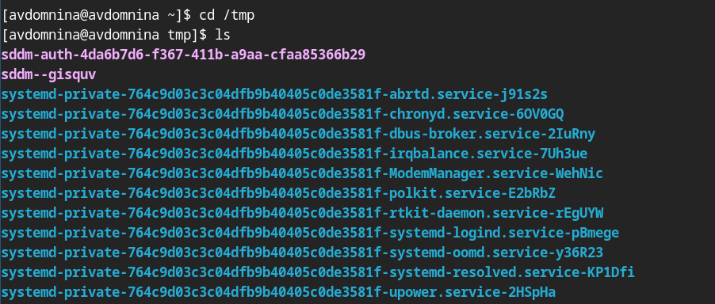

РОССИЙСКИЙ УНИВЕРСИТЕТ ДРУЖБЫ НАРОДОВ\
**Факультет физико-математических и естественных наук**\
**Математический институт имени академика С.М. Никольского**

**ОТЧЕТ ПО ЛАБОРАТОРНОЙ РАБОТЕ № 4**\
дисциплина: Операционные системы

**Студент:** Домнина Алена\
**Группа:** НПМбв-02-21

**МОСКВА**\
2025 г.

# Цель работы

Приобретение практических навыков взаимодействия пользователя с системой посредством командной строки.

# Последовательность выполнения работы

## 1. Определим полное имя нашего домашнего каталога. Далее относительно этого каталога будут выполняться последующие упражнения.

```bash
pwd
```


## 2. Выполним следующие действия:

2.1. Переходим в каталог /tmp.

```bash
cd /tmp
```



2.2. Выведем на экран содержимое каталога `/tmp`. Для этого используем команду `ls` с различными опциями.

Команда

```bash
ls -l
```

выводит список файлов и каталогов с подробной информацией:


Команда

```bash
ls -a
```

показывает все файлы, включая скрытые (последние начинаются с точки):


Команда

```bash
ls -F
```

выводит список файлов и каталогов, добавляя специальные символы к их названиям, чтобы показать их тип, у нас везде `/` - каталоги:


Команда

```bash
ls -alF
```

\- комбинация из предыдущих трех команд:


2.3. Определим, есть ли в каталоге `/var/spool` подкаталог с именем `cron`.

```bash
ls /var/spool | grep cron
```


2.4. Перейдем в наш домашний каталог и выведем на экран его содержимое.

```bash
cd ~
ls -l
```

В столбцах указано имя владельца файлов и подкаталогов: "avdomnina"


## 3. Выполним следующие действия:

3.1. В домашнем каталоге создаем новый каталог с именем `newdir`.

```bash
mkdir ~/newdir
```

3.2. В каталоге `~/newdir` создаем новый каталог с именем `morefun`.

```bash
mkdir ~/newdir/morefun
```


3.3. В домашнем каталоге создаем одной командой три новых каталога с именами `letters`, `memos`, `misk`.

```bash
mkdir ~/letters ~/memos ~/misk
```


Затем удалим эти каталоги одной командой.

```bash
rmdir ~/letters ~/memos ~/misk
```


3.4. Попробуем удалить ранее созданный каталог `~/newdir` командой `rm`.

```bash
rm ~/newdir
```


Каталог не был удален. Видим ожидаемую ошибку, необходимо использовать опцию `r`.

3.5. Удалим каталог `~/newdir/morefun` из домашнего каталога и проверим, был ли каталог удалён.

```bash
rm -r ~/newdir
```


## 4. С помощью команды `man` определим, какую опцию команды `ls` нужно использовать для просмотра содержимое не только указанного каталога, но и подкаталогов, входящих в него.

```bash
man ls
```


## 5. С помощью команды `man` определите набор опций команды `ls`, позволяющий отсортировать по времени последнего изменения выводимый список содержимого каталога с развёрнутым описанием файлов.


## 6. Используем команду `man` для просмотра описания следующих команд: `cd`, `pwd`, `mkdir`, `rmdir`, `rm`. Поясните основные опции этих команд.

```bash
man cd
```

Команда `cd [путь]` позволяет перейти в нужный каталог.

Основные опции:

- `cd ~` переходит в домашний каталог.
- `cd ..` переходит на уровень выше.
- `cd -` возвращает в предыдущий каталог.
- `cd /` перейти в корневой каталог.

```bash
man pwd
```

Команда `pwd` показывает текущий путь.

Основные опции:

- `-L` выводит путь из переменной окружения PWD, даже если он содержит символические ссылки.
- `-P` показывает реальный путь к каталогу, преобразуя символические ссылки в исходные имена.


```bash
man mkdir
```

Команда `mkdir имя_каталога` создает новЫй каталог.

Основные опции:

- `-m` задает права доступа по аналогии с `chmod`.
- `-p` создает все родительские каталоги в случае, если их нет (рекурсивно).
- `-v` выводит сообщение для каждого созданного каталога.


```bash
man rmdir
```

Команда `rmdir имя_каталога` удаляет пустой каталог.

Основные опции:

- `--ignore-fail-on-non-empty` игнорирует каждую неудачную попытку удалить непустой каталог.
- `-p` удаляет каталог и его предков, если они пусты.
- `-v` выводит результат обработки каждого каталога.


```bash
man rm
```

Команда `rm имя_файла` используется для удаления файлов и/или каталогов.

Основные опции:

- `-r` удаляет каталог и его содержимое.
- `-i` для вывода запроса подтверждения для каждого файла.
- `-v` для вывода информации об удаленных файлах.
- `-f` принудительное удаление без подтверждения.


## 7. Используя информацию, полученную при помощи команды history, выполним модификацию и исполнение нескольких команд из буфера команд.

```bash
history
```


Альтернативная запись команды `ls -l` при помощи `history`.

```bash
!96
```


Альтернативная запись команды `ls -a`, за основу берем номер команды `ls -l` и заменяем `-l` на `-a`.

```bash
!96:s/-l/-a
```


# Вывод

В ходе работы были изучены базовые команды `cd`, `pwd`, `ls`, `mkdir`, `rm`, `history` и их опции. Освоены ключевые принципы работы в Unix-терминале, что позволяет эффективно управлять файловой системой, процессами и получать справку по командам.

# Ответы на контрольные вопросы

> Что такое командная строка?

Командная строка - это текстовый интерфейс взаимодействия пользователя с операционной системой, где команды вводятся вручную с клавиатуры.

> При помощи какой команды можно определить абсолютный путь текущего каталога? Приведите пример.

Команда `pwd` выводит абсолютный путь. Мы ее использовали в начале выполнения данной лабораторной работы для определения полного имени домашнего каталога.


> При помощи какой команды и каких опций можно определить только тип файлов и их имена в текущем каталоге? Приведите примеры.

При помощи `ls -F`, где опция `-F` добавляет символы, указывающие на тип файла:

- `/` - каталог,
- `*` - исполняемый файл,
- `@` - символическая ссылка.


> Каким образом отобразить информацию о скрытых файлах? Приведите примеры.

При помощи команды `ls -a`, где опция `-a` показывает скрытые файлы (начинающиеся с точки).


> При помощи каких команд можно удалить файл и каталог? Можно ли это сделать одной и той же командой? Приведите примеры.

- Удаление файла: `rm имя_файла`.
- Удаление пустого каталога: `rmdir имя_каталога`.
- Удаление каталога с содержимым: `rm -r имя_каталога`.

`rm -r` может удалять и файлы, и каталоги.

> Каким образом можно вывести информацию о последних выполненных пользователем командах? работы?

При помощи команды `history`.

> Как воспользоваться историей команд для их модифицированного выполнения? Приведите примеры.

Необходимо воспользоваться конструкцией: `!<номер>:s/старое/новое/`.


> Приведите примеры запуска нескольких команд в одной строке.

Для последовательного выполнения нескольких команд используется символ `;`.

Пример команды:

```bash
cd; ls
```

> Дайте определение и приведите пример символов экранирования.

Символ экранирования - символ, который позволяет отменить специальное значение символа. Если в заданном контексте встречаются специальные символы (типа `.`, `/`, `*` и т.д.), надо перед ними поставить символ экранирования `\` (обратный слэш).

> Охарактеризуйте вывод информации на экран после выполнения команды ls с опцией l.

Вывод включает:

- тип файла,
- право доступа,
- число ссылок,
- владелец,
- размер,
- дата последней ревизии,
- имя файла или каталога.

> Что такое относительный путь к файлу? Приведите примеры использования относительного и абсолютного пути при выполнении какой-либо команды.

Относительный путь указывает расположение файла относительно текущего каталога.

Абсолютный путь:

```bash
cd /afs/dk.sci.pfu.edu.ru/home
```

Относительный путь:

```bash
cd ..
```

> Как получить информацию об интересующей вас команде?

Используя команду `man`.

> Какая клавиша или комбинация клавиш служит для автоматического дополнения вводимых команд?

`Tab` - автоматически дополняет команды, имена файлов и каталогов.
