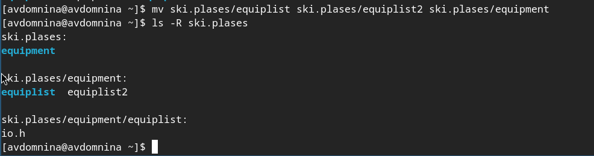
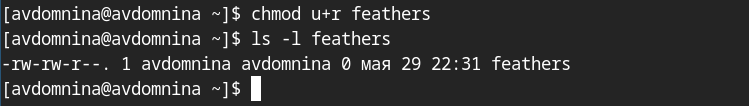

РОССИЙСКИЙ УНИВЕРСИТЕТ ДРУЖБЫ НАРОДОВ\
**Факультет физико-математических и естественных наук**\
**Математический институт имени академика С.М. Никольского**

**ОТЧЕТ ПО ЛАБОРАТОРНОЙ РАБОТЕ № 5**\
дисциплина: Операционные системы

**Студент:** Домнина Алена\
**Группа:** НПМбв-02-21

**МОСКВА**\
2025 г.


# Цель работы

Ознакомление с файловой системой Linux, её структурой, именами и содержанием каталогов. Приобретение практических навыков по применению команд для работы с файлами и каталогами, по управлению процессами (и работами), по проверке использования диска и обслуживанию файловой системы.

# Последовательность выполнения работы

## 1. Выполним все примеры, приведённые в первой части описания лабораторной работы.

5.2.2. Копирование файлов и каталогов

1. Копирование файла в текущем каталоге. Скопировать файл ~/abc1 в файл april и в файл may:

```bash
touch abc1
cp abc1 april
cp abc1 may
```


2. Копирование нескольких файлов в каталог. Скопировать файлы april и may в каталог monthly:

```bash
mkdir monthly
cp april may monthly
```


3. Копирование файлов в произвольном каталоге.Скопировать файл monthly/may в файл с именем june:

```bash
cp monthly/may monthly/june
ls monthly
```


4. Копирование каталогов в текущем каталоге. Скопировать каталог monthly в каталог monthly.00:

```bash
mkdir monthly.00
cp -r monthly monthly.00
```


5. Копирование каталогов в произвольном каталоге. Скопировать каталог monthly.00 в каталог /tmp

```bash
cp -r monthly.00 /tmp
```


## 2. Выполним следующие действия, зафиксировав в отчёте по лабораторной работе используемые при этом команды и результаты их выполнения:

2.1. Скопируем файл `/usr/include/sys/io.h` в домашний каталог и назовем его `equipment`. Если файла `io.h` нет, то используем любой другой файл в каталоге `/usr/include/sys/` вместо него.

Так же пользуемся командой `ls` и ее опциями для проверки правильности действий.

```bash
mkdir equipment
cp /usr/include/sys/io.h ~/equipment
```


2.2. В домашнем каталоге создаем директорию `~/ski.plases`.

```bash
mkdir ski.plases
```


2.3. Переместим файл equipment в каталог `~/ski.plases`.

```bash
mv equipment ski.plases
```


2.4. Переименуем файл `~/ski.plases/equipment` в `~/ski.plases/equiplist`.

```bash
mv ski.plases/equipment ski.plases/equiplist
```


2.5. Создаем в домашнем каталоге файл `abc1` и скопируем его в каталог `~/ski.plases`, назовем его `equiplist2`.

```bash
touch abc1
cp abc1 ski.plases/equiplist2
```


2.6. Создаем каталог с именем `equipment` в каталоге `~/ski.plases`.

```bash
mkdir ski.plases/equipment
```


2.7. Переместим файлы `~/ski.plases/equiplist` и `equiplist2` в каталог `~/ski.plases/equipment`.

```bash
mv ski.plases/equiplist ski.plases/equiplist2 ski.plases/equipment
```



2.8. Создаем и перемещаем каталог `~/newdir` в каталог `~/ski.plases` и назовем его `plans`.

```bash
mkdir newdir
mv newdir ski.plases/plans
```


## 3. Определим опции команды chmod, необходимые для того, чтобы присвоить перечисленным ниже файлам выделенные права доступа, считая, что в начале таких прав нет:

Используем восьмеричную форму записи прав доступа из таблицы 5.2.
Для `australia` и `play` создаем каталоги на каждом шаге, `my_os` и `feathers` файлы.

3.1. drwxr--r-- ... australia

```bash
mkdir australia
chmod 744 australia
```


3.2. drwx--x--x ... play

```bash
mkdir play
chmod 711 play
```


3.3. -r-xr--r-- ... my_os

```bash
touch my_os
chmod 544 my_os
```


3.4. -rw-rw-r-- ... feathers

```bash
touch feathers
chmod 664 feathers
```


И для проверки, воспользуемся командой `ls -l`, убеждаемся, что права выданы правильно.


## 4. Проделаем приведённые ниже упражнения, записывая в отчёт по лабораторной работе используемые при этом команды:

4.1. Просмотрим содержимое файла `/etc/password`.

```bash
cat /etc/passwd
```


4.2. Скопируем файл `~/feathers` в файл `~/file.old`.

```bash
cp feathers file.old
```


4.3. Переместим файл `~/file.old` в каталог ~/play.

```bash
mv file.old play
```


4.4. Скопируем каталог `~/play` в каталог `~/fun`.

```bash
mkdir fun
cp -r play fun
```


4.5. Переместим каталог `~/fun` в каталог `~/play` и назовем его `games`.

```bash
mv fun play/games
```


4.6. Лишим владельца файла `~/feathers` права на чтение.

```bash
chmod u-r feathers
```


4.7. Что произойдёт, если вы попытаетесь просмотреть файл `~/feathers` командой `cat`?

```bash
cat feathers
```

Ожидаемо, нам система откажет в доступе, т.к. на предыдущем этапе мы лишились пра на чтение.


4.8. Что произойдёт, если вы попытаетесь скопировать файл `~/feathers`?

```bash
cp feathers copy
```

Нам откажут в доступе.


4.9. Даем владельцу файла `~/feathers` право на чтение.

```bash
chmod u+r feathers
```



4.10. Лишим владельца каталога `~/play` права на выполнение.

```bash
chmod u-x play
```


4.11. Переходим в каталог `~/play`. Нам отказывают в доступе, т.к. в предыдущем шаге мы лишили владельца прав на выполнение.

```bash
cd play
```


4.12. Даем владельцу каталога `~/play` право на выполнение и убедимся, что можно перейти в каталог.

```bash
chmod u+x play
```


## 5. Прочитаем man по командам mount, fsck, mkfs, kill и кратко их охарактеризуйте, приведя примеры.

`mount` - подключение файловых систем. Подключает файловые системы (диски, разделы, сетевые ресурсы) к указанной точке монтирования.

```bash
man mount
```


`fsck` - проверка и восстановление файловых систем. Проверяет и исправляет ошибки в файловых системах. Нельзя применять к смонтированным разделам.

```bash
man fsck
```


`mkfs` - создание файловой системы. Форматирует раздел, создавая новую файловую систему.

```bash
man mkfs
```


`kill` - отправка сигналов процессам. Завершает или изменяет поведение процессов.

```bash
man kill
```


# Вывод

Освоены ключевые команды и принципы управления файловой системой Linux, включая манипуляции с файлами и каталогами, управление правами доступа и анализ состояния файловых систем. Полученные навыки позволяют эффективно администрировать файловую систему и обеспечивать её целостность.

# Ответы на контрольные вопросы

> Дайте характеристику каждой файловой системе, существующей на жёстком диске компьютера, на котором вы выполняли лабораторную работу.

`/dev/sda1` - `vfat`
Раздел EFI-загрузчика (обычно используется для UEFI), файловая система FAT.

`/dev/sda2` - `ext4`
Раздел /boot, классическая Linux ФС.

`/dev/sda3` - `btrfs`
Используется дважды:

- как `/` (корень)
- как `/home` (подраздел внутри btrfs)

Фактически:
`btrfs`, `ext4`, `vfat` — используются на жёстком диске.


> Приведите общую структуру файловой системы и дайте характеристику каждой директории первого уровня этой структуры.

Основные каталоги первого уровня:

- `/` - корневая файловая система. В ней находится всё остальное.
- `/home` - домашние каталоги пользователей. Здесь хранятся их файлы и настройки.
- `/boot` - содержит ядро Linux, initrd и загрузочные файлы. Используется загрузчиком.
- `/boot/efi` - EFI-раздел, используется для загрузки в UEFI-системах (содержит EFI/).
- `/dev` - содержит файлы устройств (например, /dev/sda, /dev/tty).
- `/proc` - виртуальная ФС с информацией о процессах и параметрах ядра.
- `/sys` - виртуальная ФС с данными о устройствах и ядре. Современная альтернатива /proc.
- `/run` - временные файлы, используемые во время загрузки и выполнения служб.
- `/tmp` - временные файлы приложений. Обычно очищается при перезагрузке.
- `/media` - автоматическое монтирование внешних устройств (флешки, диски).
- `/var` - переменные файлы: журналы (/var/log), очереди, кэш, временные базы.

> Какая операция должна быть выполнена, чтобы содержимое некоторой файловой системы было доступно операционной системе?

Чтобы содержимое файловой системы стало доступно, необходимо выполнить монтирование - операцию присоединения файловой системы к дереву каталогов.

```bash
mount /dev/sdb1 /mnt/docs
```

> Назовите основные причины нарушения целостности файловой системы. Как устранить повреждения файловой системы?

Основные причины:

- Внезапное отключение питания;
- Ошибки в оборудовании (HDD/SSD);
- Прерывание операций записи;
- Сбои в драйверах.

Устранение:

- Использование журналируемых ФС (например, ext4);
- Использование утилиты fsck для проверки и восстановления:

```bash
fsck /dev/sda1
```

> Как создаётся файловая система?

Создание новой файловой системы осуществляется командой `mkfs`:

```bash
mkfs.ext4 /dev/sdb1
```

> Дайте характеристику командам для просмотра текстовых файлов.

- `cat` – вывод всего файла.
- `less` – постраничный просмотр.
- `head -n 10` – первые 10 строк.
- `more` – аналог less, но без обратной прокрутки.

> Приведите основные возможности команды cp в Linux.

Копирование файлов, копирование нескольких файлов в каталог, рекурсивное копирование каталогов с опцией `r`, копирование с подтверждением перезаписи с опцией `i`.

> Приведите основные возможности команды mv в Linux.

Переименование файлов или каталогов, перемещение файлов или каталогов.

> Что такое права доступа? Как они могут быть изменены?

Права доступа - это ограничения, определяющие, кто может читать (r), записывать (w) или выполнять (x) файл/каталог.

Изменение правд происходит при помощи команды `chmod`, например:

```bash
chmod u+x may
```

,где `may` название файла/каталога, а `u+x` - символьное представление прав доступа.

Также есть и другие формы записи прав доступа:

| Двоичная | Восьмеричная | Символьная |
| :------- | :----------- | :--------- |
| 111      | 7            | rwx        |
| 110      | 6            | rw-        |
| 101      | 5            | r-x        |
| 100      | 4            | r--        |
| 011      | 3            | -wx        |
| 010      | 2            | -w-        |
| 001      | 1            | --x        |
| 000      | 0            | ---        |
