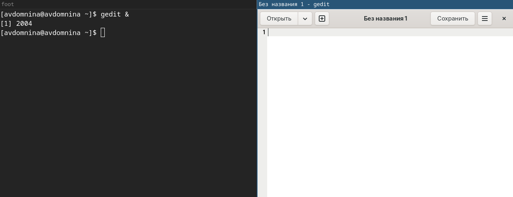

РОССИЙСКИЙ УНИВЕРСИТЕТ ДРУЖБЫ НАРОДОВ\
**Факультет физико-математических и естественных наук**\
**Математический институт имени академика С.М. Никольского**

**ОТЧЕТ ПО ЛАБОРАТОРНОЙ РАБОТЕ № 6**\
дисциплина: Операционные системы

**Студент:** Домнина Алена\
**Группа:** НПМбв-02-21

**МОСКВА**\
2025 г.

# Цель работы

Ознакомление с инструментами поиска файлов и фильтрации текстовых данных. Приобретение практических навыков: по управлению процессами (и заданиями), по проверке использования диска и обслуживанию файловых систем.

## Последовательность выполнения работы

1. Осуществляем вход в систему, используя соответствующее имя пользователя.

2. Запишем в файл `file.txt` названия файлов, содержащихся в каталоге `/etc`. Допишем в этот же файл названия файлов, содержащихся в вашем домашнем каталоге.

```bash
ls /etc > file.txt
ls ~ >> file.txt
```


И проверим содержимое файла `file.txt`.


3. Выведем имена всех файлов из `file.txt`, имеющих расширение `.conf`.

```bash
cat file.txt | grep '\.conf$'
```


После чего запишем их в новый текстовой файл `conf.txt`.

```bash
grep '\.conf$' file.txt > conf.txt
```


4. Определяем, какие файлы в нашем домашнем каталоге имеют имена, начинавшиеся с символа `c`. Вот несколько вариантов, как это можно сделать.

```bash
find ~ -name "c*" -print
ls ~/c*
echo ~/c*
```


5. Выведем на экран (по странично) имена файлов из каталога `/etc`, начинающиеся с символа `h`.

```bash
ls /etc/h* | less
```


6. Запустим в фоновом режиме процесс, который будет записывать в файл `~/logfile` файлы, имена которых начинаются с `log`.

```bash
ls log* > ~/logfile &
```


7. Удалим файл `~/logfile`.

```bash
rm logfile
```


8. Запустим из консоли в фоновом режиме редактор `gedit`.

```bash
gedit &
```



9. Определим идентификатор процесса `gedit`, используя команду `ps`, конвейер и фильтр `grep`.

```bash
ps aux | grep gedit
```


пределить идентификатор процесса?

```bash
pgrep gedit
```


1.  Прочтем справку (man) команды `kill`, после чего используем ее для завершения процесса `gedit`.

```bash
man kill
```


т.к. случано завершила работу редактора gedit в интерфейсе, нажав на кнопку закрытия редакора. Снова запускаем в консоли в фоновом режиме редактор и завершаем процесс следующей командой:

```bash
kill id_процесса
```


11. Выполним команды `df` и `du`, предварительно получив более подробную информацию об этих командах, с помощью команды man.

```bash
man df
man du
```


```bash
df -h
```


```bash
du -sh ~
```


12. Воспользовавшись справкой команды `find`, выведем имена всех директорий, имеющихся в нашем домашнем каталоге.

```bash
find ~ -type d
```


## Вывод

В ходе лабораторной работы были изучены и отработаны основные команды и инструменты Linux для перенаправления ввода-вывода, использования конвейеров, поиска файлов и фильтрации данных. Получены навыки управления задачами и процессами, а также анализа использования диска. Эти знания являются основой эффективной работы в командной строке и автоматизации рутинных задач.

## Ответы на контрольные вопросы

> Какие потоки ввода вывода вы знаете?

В Linux по умолчанию существуют три стандартных потока:

- stdin (0): стандартный поток ввода (обычно клавиатура);
- stdout (1): стандартный поток вывода (обычно консоль);
- stderr (2): стандартный поток вывода ошибок (обычно консоль).

> Объясните разницу между операцией > и >>.

- '>' - перезаписывает указанный файл выводом команды.
- '>>' - добавляет вывод команды в конец файла без перезаписи.

> Что такое конвейер?

Конвейер — механизм передачи вывода одной команды на ввод другой.

> Что такое процесс? Чем это понятие отличается от программы?

Процесс - это экземпляр выполнения программы в системе. Программа же - это файл с кодом.

> Что такое PID и GID?

PID — идентификатор процесса (Process ID).
GID — идентификатор группы (Group ID).

> Что такое задачи и какая команда позволяет ими управлять?

Задачи — это процессы, запущенные в фоне. Команда управления: `jobs`, завершение — `kill`.

> Найдите информацию об утилитах top и htop. Каковы их функции?

`top` — отображает информацию о процессах в реальном времени.
`htop` — более удобная версия top с интерактивным интерфейсом.

> Назовите и дайте характеристику команде поиска файлов. Приведите примеры использования этой команды.

Команда: `find`.
`find ~ -name "f*" -print` ищет файлы, начинающиеся на 'f' в домашнем каталоге.

> Можно ли по контексту (содержанию) найти файл? Если да, то как?

Да, можно с помощью `grep`, например: `grep 'строка' имя_файла`

> Как определить объем свободной памяти на жестком диске?

Командой `df`, которая отображает информацию о дисковых разделах, например: `df -h`.

> Как определить объем вашего домашнего каталога?

При помощи команды `du -a ~/`, которая показывает объем всех файлов и подкаталогов в домашнем каталоге.

> Как удалить зависший процесс?

Находим PID с помощью `ps` или `top` и завершить командой `kill <PID>`. При необходимости, можно воспользоваться `kill -9 <PID>`.
