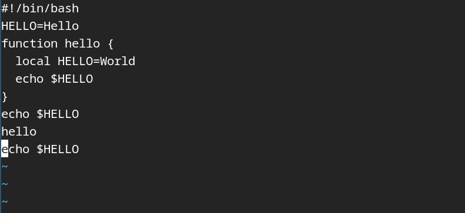

РОССИЙСКИЙ УНИВЕРСИТЕТ ДРУЖБЫ НАРОДОВ\
**Факультет физико-математических и естественных наук**\
**Математический институт имени академика С.М. Никольского**

**ОТЧЕТ ПО ЛАБОРАТОРНОЙ РАБОТЕ № 8**\
дисциплина: Операционные системы

**Студент:** Домнина Алена\
**Группа:** НПМбв-02-21

**МОСКВА**\
2025 г.

# Цель работы

Познакомиться с операционной системой Linux. Получить практические навыки работы с редактором vi, установленным по умолчанию практически во всех дистрибутивах.

# Последовательность выполнения работы

## Задание 1. Создание нового файла с использованием vi

### 1. Создаем каталог с именем `~/work/os/lab06`

```bash
mkdir -p work/os/lab06
```

### 2. И перейдем во вновь созданный каталог

```bash
cd work/os/lab06
```


### 3. Вызываем vi и создаем файл `hello.sh`

```bash
vi hello.sh
```


### 4. Нажимаем клавишу `i` и вводим следующий текст

```bash
#!/bin/bash
HELL=Hello
function hello {
LOCAL HELLO=World
echo $HELLO
}
echo $HELLO
hello
```


### 5. Нажимаем клавишу `Esc` для перехода в командный режим после завершения ввода текста

### 6. Нажимаем `:` для перехода в режим последней строки и внизу нашего экрана появится приглашение в виде двоеточия

### 7. Нажимаем `w` (записать) и `q` (выйти), а затем нажимаем клавишу Enter для сохранения нашего текста и завершения работы

```bash
:wq
```


### 8. Сделаем файл исполняемым

```bash
chmod +x hello.sh
```


## Задание 2. Редактирование существующего файла

### 1. Вызовем vi на редактирование файла

```bash
vi ~/work/os/lab06/hello.sh
```


### 2. Установим курсор в конец слова `HELL` второй строки

### 3. Перейдем в режим вставки и заменим на `HELLO`. Нажмем `Esc` для возврата в командный режим


### 4. Установим курсор на четвертую строку и сотрем слово `LOCAL`

### 5. Перейдем в режим вставки и наберем следующий текст: `local`, нажимаем `Esc` для возврата в командный режим


### 6. Установим курсор на последней строке файла. Вставим после неё строку, содержащую следующий текст: `echo $HELLO`


### 7. Нажимаем `Esc` для перехода в командный режим

### 8. Удалим последнюю строку

```bash
dd
```


### 9. Введем команду отмены изменений `u` для отмены последней команды

```bash
u
```



### 10. Введем символ `:` для перехода в режим последней строки. Запишем произведенные изменения и выйдем из vi

```bash
:wq
```


```bash
chmod +x hello.sh
```

# Вывод

В ходе лабораторной работы были изучены основные режимы и команды редактора vi, а также получены практические навыки работы с этим редактором. Освоены операции редактирования, позиционирования, поиска и управления содержимым файла.

# Ответы на контрольные вопросы

> Дайте краткую характеристику режимам работы редактора vi.

Редактор vi имеет три режима:

- Командный режим: используется для навигации и выполнения команд редактирования.
- Режим вставки: используется для ввода текста в файл.
- Режим последней строки: позволяет сохранять изменения, выходить из редактора и выполнять команды, начинающиеся с двоеточия.

> Как выйти из редактора, не сохраняя произведённые изменения?

Нужно перейти в командный режим (нажать Esc), затем ввести команду `:q!` и нажать `Enter`.

> Назовите и дайте краткую характеристику командам позиционирования.

- `0` - переход в начало строки;
- `$` - переход в конец строки;
- `G` - переход в конец файла;
- `nG` - переход к строке с номером n.

> Что для редактора vi является словом?

В vi 'слово' определяется как последовательность символов, отделенная пробелами. Команды w/W и b/B учитывают разные типы разделителей:

- `w/b` - пробелы, знаки препинания;
- `W/B` - только пробелы, табуляция, возврат каретки.

> Каким образом из любого места редактируемого файла перейти в начало (конец)

- `gg` - перейти в начало файла;
- `G` - перейти в конец файла.

> Назовите и дайте краткую характеристику основным группам команд редактирования.

- Вставка текста (`i`, `a`, `A`, `I`, `o`, `O`);
- Удаление текста (`x`, `d`, `dd`, `d$`, `d0`);
- Отмена изменений (`u`, `.`);
- Копирование и вставка (`y`, `Y`, `p`, `P`);
- Замена (`r`, `R`, `cw`, `c$`);
- Поиск текста (`/текст`, `?текст`).

> Необходимо заполнить строку символами $. Каковы ваши действия?

В командном режиме:

1. Перейти в начало строки (нажать 0);
2. Ввести команду: `C` и затем набрать нужное количество символов `$`.

> Как отменить некорректное действие, связанное с процессом редактирования?

Команда `u` отменяет последнее действие. Команда `.` повторяет последнее действие.

> Назовите и дайте характеристику основным группам команд режима последней строки.

- `:w` - сохранить файл;
- `:q` - выйти;
- `:q!` - выйти без сохранения;
- `:wq` - сохранить и выйти;
- `:e!` - отменить все изменения с момента последнего сохранения.

> Как определить, не перемещая курсора, позицию, в которой заканчивается строка?

Нажать `$` - курсор переместится в конец текущей строки, не переходя в режим вставки.

> Выполните анализ опций редактора vi (сколько их, как узнать их назначение и т.д.).

Опции можно просмотреть командой `:set all`. Назначение:

- `:set nu` - показать номера строк;
- `:set list` - отобразить спецсимволы;
- `:set ic` - игнорировать регистр при поиске.

Отключение опций - команда вида `:set nonu`.

> Как определить режим работы редактора vi?

Режим определяется контекстом:

- Если команды редактирования работают - командный режим;
- Если вводится текст - режим вставки;
- Если внизу экрана появляется ':' - режим последней строки.

> Постройте граф взаимосвязи режимов работы редактора vi.

1. При запуске vi открывается **командный режим**.
2. Из командного режима:
   - Переход в **режим вставки**: команды `i`, `a`, `o` и др.
   - Переход в **режим последней строки**: `:`
3. Из режима вставки: клавиша `Esc` возвращает в командный режим.
4. Из режима последней строки: после выполнения команды - возврат в командный режим.
